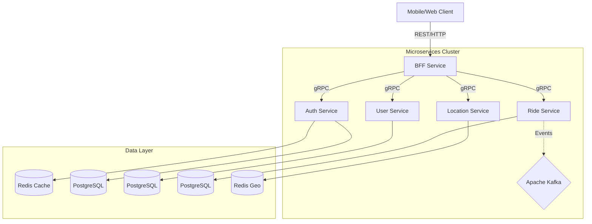

# 🚖 RideBookingApp (QuickTrip)

> **A high-performance, microservices-based ride-booking platform built for scale.**

     

---

## 📖 Overview

**RideBookingApp** (internally "QuickTrip") is a robust, distributed system designed to handle the complexities of a modern ride-hailing service. It leverages a **Microservices Architecture** to ensure independent scalability, fault tolerance, and rapid development cycles.

The system uses **gRPC** for low-latency inter-service communication and **Apache Kafka** for asynchronous, event-driven processing (e.g., ride status updates, driver matching).

## 🏗️ Architecture

The system follows a **Backend-For-Frontend (BFF)** pattern where a central gateway manages client requests and orchestrates calls to backend microservices.



## 🛠️ Technology Stack

| Category | Technology | Description |
| :--- | :--- | :--- |
| **Language** | **Java 21** | Utilizing the latest LTS features for performance and syntax improvements. |
| **Framework** | **Spring Boot 4.0.1** | Core framework for building production-ready microservices (LocationService on 3.2.5). |
| **Communication** | **gRPC & Protobuf** | High-performance RPC framework for inter-service communication. |
| **Messaging** | **Apache Kafka** | Distributed streaming platform for asynchronous events. |
| **Database** | **PostgreSQL** | Primary relational database for structured data. |
| **Caching/Geo** | **Redis** | Used for session caching and geospatial data storage (Driver locations). |
| **Migration** | **Flyway** | Database schema migration tool. |
| **Build Tool** | **Maven** | Dependency management and build automation. |

---

## 🧩 Microservices

### 1. **BFF (Backend-For-Frontend)**
   - **Role**: The entry point for all client requests. It aggregates data from various microservices and serves the frontend.
   - **Key Features**: 
     - Authentication & Authorization Gateway.
     - Protocol translation (HTTP -> gRPC).
     - Centralized error handling and validation.

### 2. **Auth Service**
   - **Role**: Manages user identity and security.
   - **Key Features**:
     - User Registration & Login.
     - **JWT** (JSON Web Token) issuance and validation.
     - **Redis** integration for token blacklisting and caching.

### 3. **User Service**
   - **Role**: Handles user profiles and data.
   - **Key Features**:
     - Driver and Rider profile management.
     - CRUD operations for user entities.
     - Stores user preferences and history.

### 4. **Ride Service**
   - **Role**: The core engine for booking and managing rides.
   - **Key Features**:
     - Ride matching logic.
     - Fare calculation.
     - **Kafka Producer/Consumer** for handling ride status changes (REQUESTED, ACCEPTED, COMPLETED).

### 5. **Location Service**
   - **Role**: Tracks real-time driver locations.
   - **Key Features**:
     - Ingests high-frequency location updates from drivers.
     - Uses **Redis Geospatial** commands to find nearby drivers efficiently.
     - optimizing for speed and throughput.

---

## 🚀 Getting Started

### Prerequisites
- **Java 21 SDK** installed.
- **Maven** installed.
- **Docker & Docker Compose** (recommended for running databases/brokers).
- **PostgreSQL** and **Redis** running locally or via Docker.
- **Kafka** & **Zookeeper** running.

### Installation

1. **Clone the repository**
   ```bash
   git clone https://github.com/DhananjayHirey/RideBookingApp.git
   cd RideBookingApp
   ```

2. **Build the project**
   Each service is a Maven project. You can build them individually:
   ```bash
   cd BFF/BFF
   mvn clean install
   ```

3. **Run the Services**
   Start the services in the following order to ensure dependencies are met:
   1. `AuthService`
   2. `UserService`
   3. `LocationService`
   4. `RideService`
   5. `BFF`

   ```bash
   # Example for running a service
   mvn spring-boot:run
   ```

## 🔮 Future Enhancements
- [ ] **Payment Service**: Integration with Stripe/Razorpay.
- [ ] **Notification Service**: Push notifications via FCM for ride updates.
- [ ] **Kubernetes Deployment**: Helm charts for K8s orchestration.

---
*Built with ❤️ by [Dhananjay Hirey](https://github.com/DhananjayHirey)*
