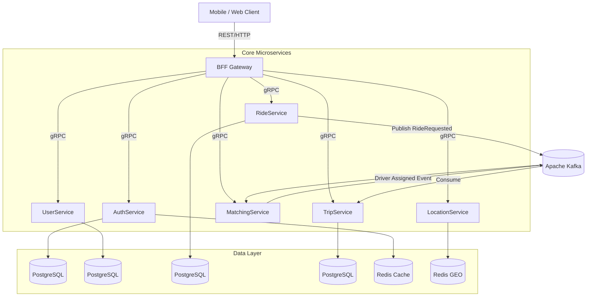
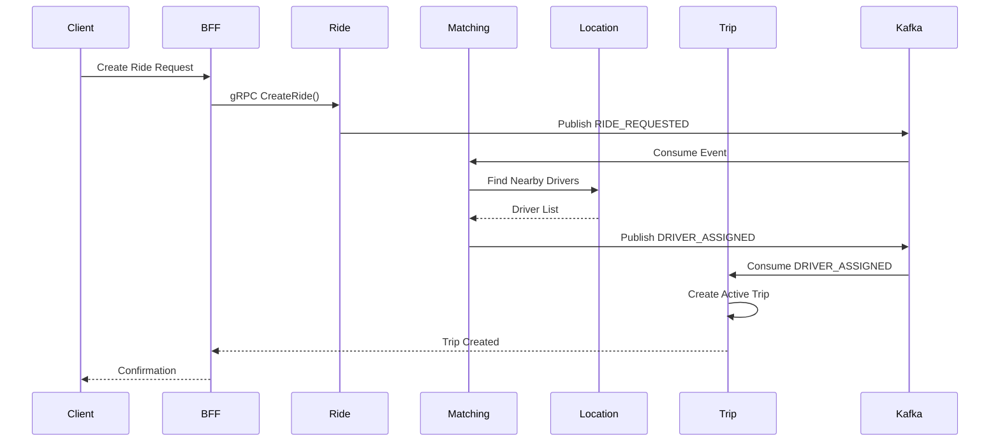
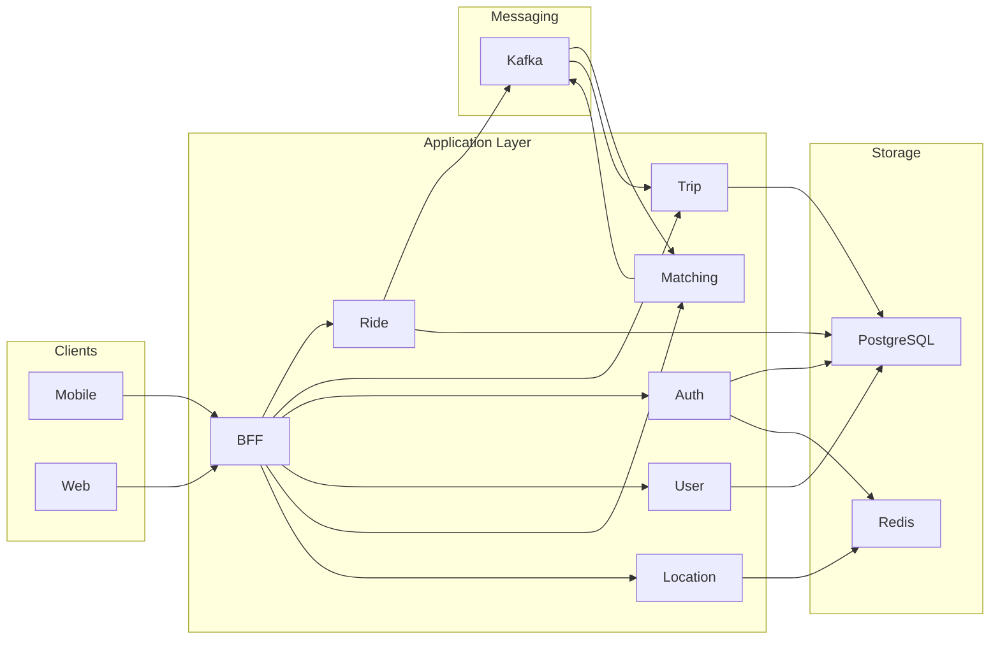

# 🚖 RideBookingApp (QuickTrip)

> A horizontally scalable, event-driven ride-hailing backend built using modern distributed systems principles.

 
 
 
 
 


---

# 📖 Overview

**RideBookingApp (QuickTrip)** is a distributed backend system inspired by real-world ride-hailing platforms.

The architecture separates:

- Ride Orchestration
- Driver Matching
- Trip Lifecycle Management
- Real-time Location Tracking
- Authentication & User Management

This separation enables independent scaling of high-load components such as matching and trip tracking.

---

# 🏗 System Architecture

## 🔹 High-Level Architecture



---

# 🔄 Ride → Match → Trip Flow



---

# 🧩 Microservices Breakdown

## 🔐 Auth Service
- JWT issuance & validation
- Redis token blacklisting
- Authentication middleware

## 👤 User Service
- Rider & Driver profiles
- Ride history
- Role management

## 🚘 Ride Service (Request Orchestrator)
- Creates ride requests
- Validates input
- Publishes `RIDE_REQUESTED` event
- Persists ride metadata

## 🎯 Matching Service
- Consumes `RIDE_REQUESTED`
- Fetches nearby drivers from LocationService
- Applies matching algorithm
- Publishes `DRIVER_ASSIGNED` event
- Designed for high scalability

## 🛣 Trip Service
- Consumes `DRIVER_ASSIGNED`
- Creates active trip
- Handles trip lifecycle:
  - STARTED
  - IN_PROGRESS
  - COMPLETED
  - CANCELLED
- Persists trip state
- Handles fare finalization

## 📍 Location Service
- High-frequency driver updates
- Redis GEO indexing
- Radius-based driver lookup

## 🌉 BFF Gateway
- Client entry point
- HTTP → gRPC translation
- Centralized error handling
- JWT validation

---

# 📊 Scalability Strategy

| Component | Scaling Strategy |
|------------|------------------|
| MatchingService | Horizontally scalable (stateless consumers) |
| TripService | Scaled per active trip load |
| RideService | Moderate scaling |
| LocationService | Redis cluster scaling |
| Kafka | Partition-based scaling |
| PostgreSQL | Service-level isolation |

---

# 🧠 Architectural Advantages

## Separation of Concerns

- RideService → Request creation
- MatchingService → Driver selection
- TripService → Active trip lifecycle

This prevents:

- Heavy matching logic blocking ride creation
- Trip state management interfering with matching
- Tight coupling between services

---

# 🏗 Infrastructure View



---

# 📦 Local Setup

```bash
git clone https://github.com/DhananjayHirey/RideBookingApp.git
cd RideBookingApp
docker-compose up
mvn clean install
```

Start in order:

1. AuthService  
2. UserService  
3. LocationService  
4. RideService  
5. MatchingService  
6. TripService  
7. BFF  

---

# 🔮 Future Enhancements

- Payment Service
- Notification Service
- Surge Pricing Engine
- Driver Rating System
- Kubernetes Deployment
- CI/CD Pipeline
- Distributed Tracing
- Circuit Breakers

---

# ❤️ Author

**Dhananjay Hirey**  
Backend & Distributed Systems Enthusiast  
Focused on building scalable architectures.
